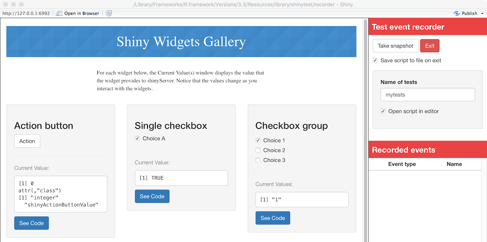
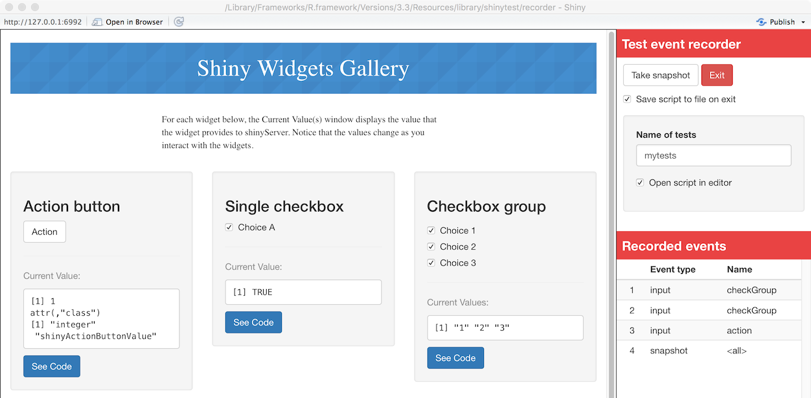
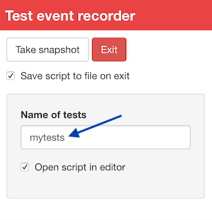

```{r setup, include=FALSE}
knitr::opts_chunk$set(echo = TRUE, eval = FALSE)
```


## Why test Shiny applications?

After you get your Shiny application to a state where it works, it's often useful to have an automated system that checks that it continues to work as expected. There are many possible reasons for an application to stop working. These reasons include:

* An ugpraded R package has different behavior. (This could include Shiny itself!)
* You make modifications to your application.
* An external data source stops working, or returns data in a changed format.

One way to detect these problems is with manual testing -- in other words, by having a person interact with the app in a browser -- but this can be time-intensive, inconsistent, and imprecise. Having automated tests can alert you to these kinds of problems quickly and with almost zero effort, after the tests have been created.


## How testing works with shinytest

The **shinytest** package provides tools for creating and running automated tests on Shiny applications.

Shinytest uses snapshot-based testing strategy. The first time it runs a set of tests for an application, it performs some scripted interactions with the app and takes one or more snapshots of the application's state. These snapshots are saved to disk so that future runs of the tests can compare their results to them.

To create tests, the easiest method is to use the `recordTest()` function. This launches the application in a web browser and records your interactions with the application. These interactions are saved in a .R file, and are run using the strategy described above.


## Getting started


**Shinytest** is in active development, and also requires the development version of Shiny. To install them:

```{r}
library(devtools)
install_github("rstudio/shiny")
install_github("MangoTheCat/processx")
install_github("MangoTheCat/webdriver")
install_github("MangoTheCat/shinytest")
```


### Recording tests

This is the general procedure for recording tests:

* Run `recordTest()` to launch the app in a test recorder.
* Create the tests by interacting with the application and telling the recorder to snapshot the state at various points.
* Quit the test recorder. The test script will be saved in a .R file in a subdirectory of the application, named `tests/`. If you are running in the RStudio IDE, it will automatically open this file in the editor.

To record tests, run the following:

```{r}
library(shinytest)

# Launch the target app (replace with the correct path)
recordTest("PATH/TO/APP")
```

In a separate R process, this launches the Shiny application to be tested. We'll refer to this as the **target app**. This also launches a special Shiny application in the current R process which displays the target app in an iframe and has some controls outside the iframe. We'll refer to this as the **recorder app**. You will see something like this:



On the left is the target app (in this case, the "Shiny Widgets Gallery"), and on the right is the recorder app (titled "Test event recorder"). Note that you may need to make the browser window wider because the recorder panel occupies some space.

The panel on the right displays some controls for the test recorder, as well as a list of **Recorded events**. As you interact with the target app -- in other words, when you set inputs on the app -- you will see those interactions recorded in the Recorded events list.

For testing a Shiny application, setting inputs is only one part. It's also necessary to check that the application produces the correct outputs. This is accomplished by taking snapshots of the application's state.

There are two ways to record output values. One way is to take a **snapshot** of the application's state. This will record all input values, output values, and *exported* values (more on exported values later). To do this, click the "Take snapshot" button on the recorder app.

After modifying some inputs and taking a snapshot, it will look something like this:



It is also possible to take a target snapshot, of just a specific output. To do this, hold down the Control button on your keyboard and  click on an output: when you do that, it take a snapshot of just that output.


When you are done recording a sequence of events, click on the "Exit" button. If you are in the RStudio IDE, it will open the test script in the `tests/` subdirectory of the application. In this case, the name of the script is `mytests.R`:

```{r}
app <- ShinyDriver$new("..")
app$snapshotInit("mytests")

app$setInputs(checkGroup = c("1", "2"))
app$setInputs(checkGroup = c("1", "2", "3"))
app$setInputs(action = "click")
app$snapshot()

app$snapshotCompare()
```

### Running tests

After you have used the test recorder to create a test script, you must run the test script. There are three separate components involved in running the tests:

1. First is the **test driver**. This is the R process that coordinates the testing and controls the web browser. When working on creating tests interactively, this is the R session that you use.

1. Next is the **Shiny process**, also known as the **server**. This is the R process that runs the target Shiny application.

1. Finally, there is the **web browser**, also known as the **client**, which connects to the server. This is a headless web browser -- one which renders the web page internally, but doesn't actually display the content to the screen ([PhantomJS](http://phantomjs.org/)).

To run the test script, do the following:

```{r}
library(shinytest)

# Replace with the correct path
recordTest("PATH/TO/APP")
```

The first time you run tests, you will see something like this:

```
> testApp("PATH/TO/APP")
====== Running mytests.R ======
  No existing snapshots at mytests-expected/. This is a first run of tests.
  To save current results as expected results, run:
    snapshotUpdate("mytests", "PATH/TO/APP")
```

This will play back the interactions and record snapshots, as specified in the test script. The snapshots will be saved in a subdirectory of the app's `tests/` directory; in this case, it will be called `tests/mytests-current`. That directory will contain two files:

```
001.json
001.png
```

The .json file is a JSON representation of the state of the application when `app$snapshot()` was called. The .png file is a screenshot of the application, which you can look at to inspect the state of the application.

The JSON file stores the state of all the input, output, and export values at the time of the snapshot:

```json
{
  "input": {
    "action": 0,
    "checkbox": true,
    "checkGroup": ["1", "2", "3"],
    "date": "2014-01-01",
    "dates": ["2016-12-12", "2016-12-12"],
    "file": null,
    "num": 1,
    "radio": "1",
    "select": "1",
    "slider1": 50,
    "slider2": [25, 75],
    "text": "Enter text..."
  },
  "output": {
    "actionOut": "[1] 0\nattr(,\"class\")\n[1] \"integer\"                \"shinyActionButtonValue\"",
    "checkboxOut": "[1] TRUE",
    "checkGroupOut": "[1] \"1\" \"2\" \"3\"",
    "dateOut": "[1] \"2014-01-01\"",
    "datesOut": "[1] \"2016-12-12\" \"2016-12-12\"",
    "fileOut": "NULL",
    "numOut": "[1] 1",
    "radioOut": "[1] \"1\"",
    "selectOut": "[1] \"1\"",
    "slider1Out": "[1] 50",
    "slider2Out": "[1] 25 75",
    "textOut": "[1] \"Enter text...\""
  },
  "export": {}
}
```

If the results in the JSON and PNG files look correct, save the results by running:

```{r}
snapshotUpdate("mytests", "PATH/TO/APP")
```

This saves the most recent test results as the *expected* results for future runs. It simply renames the `mytests-current/` directory to `mytests-expected/`. If you are using a source control system (like git), you should check in the contents of this directory.


### Subsequent test runs

After the initial test run, you can run the tests again in the future. If there are no changes to the snapshots, you will just see something like this, with no additional output:

```
> testApp("PATH/TO/APP")
====== Running mytests.R ======
```

If there are any changes, you'll see output like this:

```
====== Running mytests.R ======
  Differences detected between mytests-current/ and mytests-expected/:

    Name         Status      
    001.json   ≠ Files differ
    001.png    ≠ Files differ

  To save current results as expected results, run:
    snapshotUpdate("mytests", "PATH/TO/APP")
```

At this point, you can use a diffing tool to see what is different between the expected and current tests. (NOTE: this will be made easier in the future.) You can also look at the screenshots to check if they have the expected result. If the changes are as you expect, then you can call `snapshotUpdate()`. This will delete the old `mytests-expected/` snapshot directory, and `mytests-current/` directory to  `mytests-expected/`.


### Multiple test scripts

In the example above, we had a single test script, named `mytests.R`. If you want to have more than one set of tests for an application, you can record new tests, each with a different name. You can enter the name when recording your tests:




When you run `testApp("PATH/TO/APP")`, it will run all the tests scripts in the application's `tests/` directory.


## Testing in depth

### Customizing test scripts

The test recorder is the easiest way to create test scripts, but it is not the only way. You can create and edit test scripts manually.

A test script has this basic structure: first, there is an initialization, then the tests, and finally the tests are wrapped up.

In the initialization, the script creates a new ShinyDriver object and tells it what name to use for this set of tests.

```{r}
# Initialize a ShinyDriver object using the app in the test script's parent
# directory
app <- ShinyDriver$new("..")
app$snapshotInit("mytests")
```

Next, it defines some interactions with the application and takes snapshots.

```{r}
app$setInputs(checkGroup = c("1", "2"))
app$setInputs(checkGroup = c("1", "2", "3"))
app$setInputs(action = "click")
app$snapshot()

app$setInputs(action = "click")
app$snapshot()
```

Finally, the last step is to call the `snapshotCompare()` method, which compares the current snapshots to the expected snapshots, and prints out messages if they differ:

```{r}
app$snapshotCompare()
```

For customizing a script, the middle portion -- the interactions and snapshots -- is the part you will want to modify. For snapshot-based testing, there are two methods that are used: `app$setInputs()` and `app$snapshot()`.

#### Setting inputs with `app$setInputs()`

With `app$setInputs()`, you provide the name of one or more inputs and corresponding values to set them to. Consider this set of directives:

```{r}
app$setInputs(checkGroup = c("1", "2"))
app$setInputs(checkGroup = c("1", "2", "3"))
app$setInputs(action = "click")
```

Notice that we set the value of `checkGroup` two times in a row. When we recorded this test script, it started with the value `"1"`, and then we checked the `"2"` and `"3"` boxes. The recorded script set the value to `c("1", "2")`, and then ` c("1", "2", "3")`. The `c("1", "2")` value was simply an intermediate step.

It's possible to simplify and speed up the tests by dropping the intermediate step, which leaves us with this:

```{r}
app$setInputs(checkGroup = c("1", "2", "3"))
app$setInputs(action = "click")
```

And it's also possible to set `action` in the same call, resulting in this:

```{r}
app$setInputs(
  checkGroup = c("1", "2", "3"),
  action = "click"
)
```

This will set the values of inputs simultaneously, which will make the tests run faster.

This is because, when `app$setInputs()` is called, it normally returns control only after one of two things happens:

1. The server sends any updated output value to the client.
1. A timeout elapses. The default is 3 seconds.

The reason it waits for an update to outputs is so that a subsequent call to `app$snapshot()` will be sure to capture the updated output values. If `app$setInputs()` did not wait for a update, then, if the output update did not happen very quickly, a snapshot might capture the state of the application before the outputs are updated.

Because `app$setInputs()` waits for an update, there are two things to keep in mind:

* It is faster to set multiple inputs in a single call to `app$setInputs()`, than it is to have multiple calls to `app$setInputs()`.
* If setting inputs does not result in any updates to output values, then it will simply wait for the timeout, which can slow down tests considerably.

To avoid the timeouts, you can in most cases set multiple inputs in a single call to `setInputs()`. If that is not appropriate for your particular case, you can also tell it to **not** wait for an update, with `setInputs(wait_ = FALSE, values_ = FALSE)`.

The `values_=FALSE` is required when using `wait_=FALSE`. Normally, `setInputs()` (invisibly) returns all input, output, and exported values, which can be used for expectation-style testing. The `values_=FALSE` option tells it not to return the values, and is required when using `wait_=FALSE`. Otherwise, if it returned the values without waiting for an update, those values would be unpredictable because in practice they could actually be fetched before or after an update due to the asynchronous nature of the system.


#### Taking snapshots with `app$snapshot()`

There are two ways to use `app$snapshot()`. The simplest way is to call it with no arguments:

```{r}
app$snapshot()
```

The first time this is called in a test script, it will record all input, output, and exported values from the application, in a file called `001.json`. The next call will save the values in `002.json`, and so on.

Each time you call `app$snapshot()`, it will also save a **screen shot** of the web browser, in a file `001.png`, `002.png`, and so on. These screen shots are useful for debugging your tests and inspecting what they're doing. You can tell it to not take a screen shot, to save space and make the tests run slightly faster, with:

```{r}
app$snapshot(screenshot = FALSE)
```

If you want more targeted tests, you can snapshot specific items with the `items` argument. For example, to capture the value of just the outputs named `"a"` and `"b"`, you would call:

```{r}
app$snapshot(items = list(output = c("a", "b")))
```

The value passed to `items` is a named list, where the `output` is a character vector with the names of outputs to snapshot. You could also capture specific inputs or exports:

```{r}
app$snapshot(items = list(
  input = "n",
  output = c("a", "b"),
  export = c("e1", "e2")
))
```

Finally, if you want to snapshot all outputs but no inputs or exports, you can simply set `output` to `TRUE`:

```{r}
app$snapshot(items = list(output = TRUE))
```

The same can be used to snapshot all inputs and/or all exports. To capture all outputs and exports, but no inputs:

```{r}
app$snapshot(items = list(output = TRUE, export = TRUE))
```


### Debugging test scripts

If you need to debug a test script, you can run line-by-line from the R console. However, you likely will have modify the first line. It normally will refer to the Shiny application the parent directory (`".."`):

```{r}
app <- ShinyDriver$new("..")
```

When the test is run the usual way, with `testApp()`, it will be run with the test directory as the working directory. However, when you run the tests from the command line, you generally will have a different working directory. To run the tests from a different directory, you will have to pass in the path to the application. It can be a relative path, for example:

```{r}
app <- ShinyDriver$new("path/to/app")
```

The rest of the test script can be run unchanged.


#### Screenshots

As you step through the script, you can inspect the state of the application in a few different ways. One is to view a screenshot. You should not to call `app$snapshot()` to get a screenshot, because it will increment the snapshot counter and shift the numbers of snapshots that really are part of the tests (e.g., snapshot 003 would be come 004). Instead you can do this:

```{r}
app$take_screenshot()
```

This will display the screenshot as if it were a plot. (In RStudio, it will show in the Viewer pane.) You can inspect the screenshot to see the state of the application.


#### Getting input, output, and export values

It can also be useful to get the current input, output, and export values. As with screenshots, this is something that `app$snapshot()` does, but we don't want to call that function because increments the snapshot counter.

To fetch all values, you can call `app$getAllValues()`. This returns a list, which you can inspect with the `str()` function. It may look something like this:

```{r}
vals <- app$getAllValues()

str(vals)
#> List of 3
#>  $ input :List of 4
#>   ..$ action    :Classes 'integer', 'shinyActionButtonValue'  int 0
#>   ..$ checkbox  : logi TRUE
#>   ..$ checkGroup: chr "1"
#>   ..$ text      : chr "Enter text..."
#>  $ output:List of 12
#>   ..$ actionOut    : chr "[1] 0\nattr(,\"class\")\n[1] \"integer\"                #> \"shinyActionButtonValue\""
#>   ..$ checkboxOut  : chr "[1] TRUE"
#>   ..$ checkGroupOut: chr "[1] \"1\""
#>   ..$ textOut      : chr "[1] \"Enter text...\""
#>  $ export: Named list()
```

The same data is returned (invisibly) from each call to `app$setInput()`, so you can also look at the return value from those function calls to get the same result.

The values retrieved this way can be used for expectation-based testing. For example, if you are using the **testthat** package for testing you could do something like:

```{r}
vals <- app$getAllValues()
# Another option: save values when setting input values
# vals <- app$setInputs(checkbox = TRUE)

expect_identical(vals$output$checkboxOut, "[1] TRUE")
```
