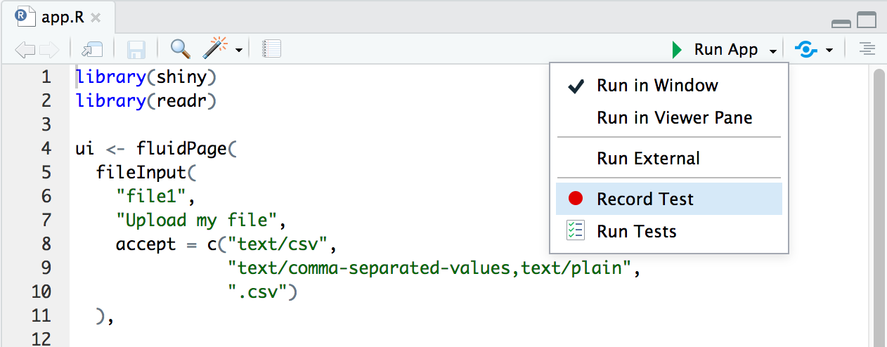
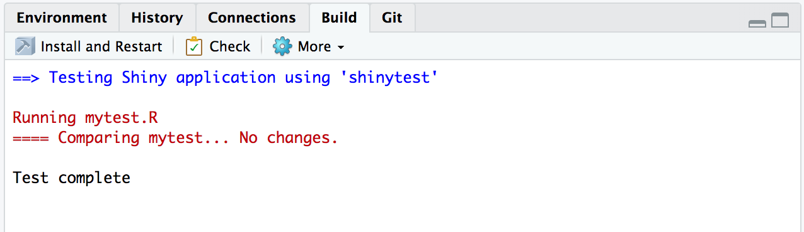

```{r setup, include=FALSE}
```

## Shinytest in the RStudio IDE

The RStudio IDE provides a graphical interface that make it even easier to create tests for Shiny applications. The GUI provides buttons for running shinytest commands, so that you don't have to remember them. These features are available in version 1.2 of the IDE and above.

When an application file (app.R, server.R, ui.R, or global.R) is open in the editor, a button labeled **Run App** will show at the top of the editor pane. If you click on the small black triangle next to **Run App**, a menu will appear.

```{r echo=FALSE}

```

If you click on **Record Test**, it will start the test recorder by calling `recordTest()` for that application.

If you click on **Run Tests**, it will run all the test scripts in the tests/ directory, and display the results in the Build pane. If the tests pass, it will look something like this:

```{r echo=FALSE}

```

If any of the tests fail, it will look like this:

```{r echo=FALSE}
knitr::include_graphics("ide-results-fail.png")
```

You can click on the **Output** button to see the full text output from shinytest.

```{r echo=FALSE}
knitr::include_graphics("ide-results-fail-output.png")
```

When a test fails, the IDE will also automatically open the failing test script (mytest.R, for example) in the editor. There are also two buttons for test scripts: **Compare Results**, which opens the diff viewer for comparing the expected and current results, and **Run Tests**, which runs the test script.
