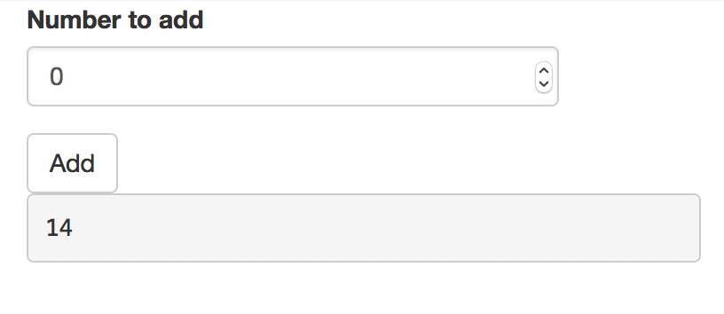

```{r setup, include=FALSE}
knitr::opts_chunk$set(echo = TRUE, eval = FALSE)
```

## Customizing test scripts

The test recorder is the easiest way to create test scripts, but it is not the only way. You can create and edit test scripts manually.

A test script has this basic structure: first, there is an initialization, then the tests, and finally the tests are wrapped up.

In the initialization, the script creates a new ShinyDriver object and tells it what name to use for this set of tests.

```{r}
# Initialize a ShinyDriver object using the app in the test script's parent
# directory
app <- ShinyDriver$new("..")
app$snapshotInit("mytest")
```

Next, it defines some interactions with the application and takes snapshots.

```{r}
app$setInputs(checkGroup = c("1", "2"))
app$setInputs(checkGroup = c("1", "2", "3"))
app$setInputs(action = "click")
app$snapshot()

app$setInputs(action = "click")
app$snapshot()
```

For customizing a script, the second portion -- the interactions and snapshots -- is the part you will want to modify. For snapshot-based testing, there are two methods that are used: `app$setInputs()` and `app$snapshot()`.

### Setting inputs with `app$setInputs()`

With `app$setInputs()`, you provide the name of one or more inputs and corresponding values to set them to. Consider this set of directives:

```{r}
app$setInputs(checkGroup = c("1", "2"))
app$setInputs(checkGroup = c("1", "2", "3"))
app$setInputs(action = "click")
```

Notice that we set the value of `checkGroup` two times in a row. When we recorded this test script, it started with the value `"1"`, and then we checked the `"2"` and `"3"` boxes. The recorded script set the value to `c("1", "2")`, and then ` c("1", "2", "3")`. The `c("1", "2")` value was simply an intermediate step.

It's possible to simplify and speed up the tests by dropping the intermediate step, which leaves us with this:

```{r}
app$setInputs(checkGroup = c("1", "2", "3"))
app$setInputs(action = "click")
```

And it's also possible to set `action` in the same call, resulting in this:

```{r}
app$setInputs(
  checkGroup = c("1", "2", "3"),
  action = "click"
)
```

This will set the values of inputs simultaneously, which will make the tests run faster.

This is because, when `app$setInputs()` is called, it normally returns control and moves on to the next step only after the server sends a response to the client.

The reason it waits for a response is so that a subsequent call to `app$snapshot()` will be sure to capture the updated output values. If `app$setInputs()` did not wait for a update, then, if the output update did not happen very quickly, a snapshot might capture the state of the application before the outputs are updated.

Because `app$setInputs()` waits for an update each time, it is faster to set multiple inputs in a single call to `app$setInputs()` than it is to have multiple calls to `app$setInputs()`.

Note: In versions of Shiny before 1.0.4, calls to `app$setInputs()` which did not result in an output value change would timeout, and print a message about setting a longer timeout or calling `setInputs(wait_ = FALSE, values_ = FALSE)`. This is because those versions of Shiny did not send a response when no output values changed. As of Shiny 1.0.4, when in testing mode, Shiny always sends a response to input changes, even if no output values have changed, so this message should no longer appear.


### Taking snapshots with `app$snapshot()`

There are two ways to use `app$snapshot()`. The simplest way is to call it with no arguments:

```{r}
app$snapshot()
```

The first time this is called in a test script, it will record all input, output, and exported values from the application, in a file called `001.json`. The next call will save the values in `002.json`, and so on.

Each time you call `app$snapshot()`, it will also save a **screen shot** of the web browser, in a file `001.png`, `002.png`, and so on. These screen shots are useful for debugging your tests and inspecting what they're doing. You can tell it to not take screen shots, to save space and make the tests run slightly faster, in the initialization step, with:

```{r}
app$snapshotInit("mytest", screenshot = FALSE)
```

If you want to disable screenshots for a single snapshot, you can use:

```{r}
app$snapshot(screenshot = FALSE)
```

If you want more targeted tests, you can snapshot specific items with the `items` argument. For example, to capture the value of just the outputs named `"a"` and `"b"`, you would call:

```{r}
app$snapshot(items = list(output = c("a", "b")))
```

The value passed to `items` is a named list, where the `output` is a character vector with the names of outputs to snapshot. You could also capture specific inputs or exports:

```{r}
app$snapshot(items = list(
  input = "n",
  output = c("a", "b"),
  export = c("e1", "e2")
))
```

Finally, if you want to snapshot all outputs but no inputs or exports, you can simply set `output` to `TRUE`:

```{r}
app$snapshot(items = list(output = TRUE))
```

The same can be used to snapshot all inputs and/or all exports. To capture all outputs and exports, but no inputs:

```{r}
app$snapshot(items = list(output = TRUE, export = TRUE))
```


### Exported values

In some cases, it's useful to snapshot some bits of internal state of an application -- state that's not reflected directly in the inputs or outputs. This can be done by *exporting* values.

Consider this toy example where an application displays a cumulative sum, and also internally keeps track of all numbers that have been added, in a numeric vector named `nums`.


```{r}
shinyApp(
  fluidPage(
    numericInput("n", "Number to add", 4),
    actionButton("add", "Add"),
    verbatimTextOutput("sum", placeholder = TRUE)
  ),
  function(input, output, session) {
    nums <- numeric()

    c_sum <- eventReactive(input$add, {
      nums <<- c(nums, input$n)
      sum(nums)
    })

    output$sum <- renderText({
      c_sum()
    })

    exportTestValues(nums = { nums })
  }
)
```

```{r echo=FALSE, eval=TRUE}

```

Notice this line:

```{r}
    exportTestValues(nums = { nums })
```

This creates an export value named `nums`. When a test snapshot is taken, it evaluates the expression `{ nums }`, and the returned value is included in the snapshot. Here's what the snapshot would look like if we add a few numbers and then take the snapshot:

```json
{
  "input": {
    "add": 4,
    "n": 0
  },
  "output": {
    "sum": "14"
  },
  "export": {
    "nums": [4, 7, 3, 0]
  }
}
```

The curly braces around `{ nums }` are not strictly necessary, but they are in this example to make it clear that, when `exportTestValues()` is called, it is the expression that is stored for later use, not the value. If the value of `nums` were saved immediately, then it would be an empty vector, and every time a snapshot is taken, it would simply return that empty vector.


### Adding delays

In some cases, you may need to wait for some amount of time between steps. You can do this by adding `Sys.sleep()` in your script. For example:

```{r}
Sys.sleep(0.5)
```

If you are waiting for some reactives to be calculated, please read more in the [Waiting for an `input` (or `output`) value](#wait-for-value) section.


### Controlling randomness

If your application uses randomly-generated values (by calling functions like `rnorm`, `runif`, `sample` directly or indirectly), then, in normal operation, it will produce different results on each run. Because Shinytest works by comparing the current state of an application to a previous state, these random changes will cause test failures.

To make such applications exactly repeatable, you can set the random seed. This can be done by specifying a random seed in the recorder. The seed can be any integer value.

```{r echo=FALSE, eval=TRUE}
knitr::include_graphics("screenshot-recorder-random-seed.png")
```

If your test script has already been created, you can set the random seed by editing the test script so that the `ShinyDriver$new()` call has a value for `seed`. Moreover, if you need these tests to pass on multiple versions of R with different `RNGkind()` defaults (e.g., 3.5 and 3.6), you may want to set a fixed `RNGkind()` across your tests (perhaps via `RNGversion("3.5.0")`). The **shinytest** package does this in its own automated tests [via a **testthat** helper](https://github.com/rstudio/shinytest/tree/master/tests/testthat/test-helper-rng.R).

```{r}
app <- ShinyDriver$new("../", seed = 4323)
```

In many cases, instead of setting the random seed, it is more elegant to use an [output preprocessor](faq.html#can-i-modify-the-output-and-input-values-that-are-recorded-in-snapshots).


## Widgets

### Tabs

With tabbed views, such as `tabsetPanel()` and `navbarPage()`, in order for shinytest to keep track of which tab is currently selected, they must have an `id`. For example:


```{r}
tabsetPanel(id = "tabs", ....)
```

or

```{r}
navbarPage(id = "tabs", ....)
```

### Uploading files

If you record a file upload event to a `fileInput`, you should uncheck **Run test script on exit** in the recorder, for reasons explained below. The test script will have a line like this:

```{r}
app$uploadFile(file1 = "mtcars.csv")
```

Notice that the filename mtcars.csv appears in the script without a path. This is because the test recorder does not know where the file came from; it only knows the name of the file.

Before you run the test script, you must copy the file to the tests/ directory.  See the tests/ subdirectory of [this app](https://github.com/rstudio/shinytest/tree/master/tests/testthat/recorded_tests/009-upload) for an example.

After copying the file to that directory, run `testApp()` as usual.


## Debugging test scripts

If you need to debug a test script, you can run line-by-line from the R console. However, you likely will have modify the first line. It normally will refer to the Shiny application the parent directory (`".."`):

```{r}
app <- ShinyDriver$new("..")
```

When the test is run the usual way, with `testApp()`, it will be run with the test directory as the working directory. However, when you run the tests from the command line, you generally will have a different working directory. To run the tests from a different directory, you will have to pass in the path to the application. It can be a relative path, for example:

```{r}
app <- ShinyDriver$new("path/to/app")
```

The rest of the test script can be run unchanged.


### Screenshots

As you step through the script, you can inspect the state of the application in a few different ways. One is to view a screenshot. You should not to call `app$snapshot()` to get a screenshot, because it will increment the snapshot counter and shift the numbers of snapshots that really are part of the tests (e.g., snapshot 003 would become 004). Instead you can do this:

```{r}
app$takeScreenshot()
```

This will display the screenshot as if it were a plot. (In RStudio, it will show in the Viewer pane.) You can inspect the screenshot to see the state of the application.


### Getting input, output, and export values

It can also be useful to get the current input, output, and export values. As with screenshots, this is something that `app$snapshot()` does, but we don't want to call that function because increments the snapshot counter.

To fetch all values, you can call `app$getAllValues()`. This returns a list, which you can inspect with the `str()` function. It may look something like this:

```{r}
vals <- app$getAllValues()

str(vals)
#> List of 3
#>  $ input :List of 4
#>   ..$ action    :Classes 'integer', 'shinyActionButtonValue'  int 0
#>   ..$ checkbox  : logi TRUE
#>   ..$ checkGroup: chr "1"
#>   ..$ text      : chr "Enter text..."
#>  $ output:List of 12
#>   ..$ actionOut    : chr "[1] 0\nattr(,\"class\")\n[1] \"integer\"                #> \"shinyActionButtonValue\""
#>   ..$ checkboxOut  : chr "[1] TRUE"
#>   ..$ checkGroupOut: chr "[1] \"1\""
#>   ..$ textOut      : chr "[1] \"Enter text...\""
#>  $ export: Named list()
```

The same data is returned (invisibly) from each call to `app$setInput()`, so you can also look at the return value from those function calls to get the same result.

The values retrieved this way can be used for expectation-based testing. For example, if you are using the **testthat** package for testing you could do something like:

```{r}
vals <- app$getAllValues()
# Another option: save values when setting input values
# vals <- app$setInputs(checkbox = TRUE)

expect_identical(vals$output$checkboxOut, "[1] TRUE")
```

### Waiting for an `input` (or `output`) value {#wait-for-value}

In most situations, when an input value is set, `app$setInputs` will wait up to 3 seconds (default) for the next value to be sent to the server.  If, however, you have an application that does not immediately send the value you are interested in, you will need to insert at `app$waitForValue` function call.  This is readily useful for htmlwidgets or anything that involves javascript code for values to be set. This method can also be used to determine when `input` (or `output`) values have been set after the initial output values have been set or for when reactivity is done in two or more stages.

For example, when checking a checkbox that adds dynamic UI, such as the old faithful Shiny example, three round trips from the browser to the Shiny server will need to occur.

1. Checking the checkbox
2. Putting the slider and plot placeholder into the app's UI
3. Once the slider is recognized by the browser, it will send information back to Shiny causing the plot to be rendered and placed in the browser

If we were to only use `app$setInput("chkbx", TRUE)` and immediately take a snapshot, we would most likely miss the correct plot value.

To dig into this further, we can look at this situation's example code:

**`app.R`:**
```r
library(shiny)

ui <- fluidPage(
  checkboxInput("chkbx", "Display Graph?", FALSE),
  uiOutput("dynamic_output")
)

server <- function(input, output) {
  output$dynamic_output <- renderUI({
    if(!input$chkbx) {
      return(NULL)
    }
    tagList(
      sliderInput(inputId = "bins", label = "Number of bins:", min = 1, max = 50, value = 30),
      plotOutput(outputId = "distPlot")
    )
  })

  # will not execute until `input$bins` is available
  # `input$bins` is not available until `chkbx` is checked
  output$distPlot <- renderPlot({
    # artificially slow the plot
    Sys.sleep(5)

    x    <- faithful$waiting
    bins <- seq(min(x), max(x), length.out = input$bins + 1)
    hist(x, breaks = bins, col = "#75AADB", border = "white",
         xlab = "Waiting time to next eruption (in mins)",
         main = "Histogram of waiting times")
  })
}
shinyApp(ui = ui, server = server)
```

Typically we would add `Sys.sleep()` function calls to slow down `shinytest` testing to hope that the Shiny application is in a stable state.

**`./tests/mytest-sleep-bad.R`:**
```r
app <- ShinyDriver$new("../")
app$snapshotInit("mytest")

# Check the box to display the slider and plot
app$setInputs('chkbx', TRUE)
# Hope that the plot appears within 7 seconds
Sys.sleep(7)

app$snapshot()

app$setInputs(bins = 40)
# Hope the newer plot appears within 7 seconds
Sys.sleep(7)

app$snapshot()
```

The above pattern could fail if executed on a slower machine. As of `shinytest` v1.4.0, we can wait for `input` (or `output`) values using `app$waitForValue`.  The pattern of _sleeping and hoping_ can now be replaced with `app$waitForValue`.


**`./tests/mytest-waitForValue-good.R`:**
```r
app <- ShinyDriver$new("../")
app$snapshotInit("mytest")

# Check the box to display the slider and plot
app$setInputs(chkbx = TRUE)

# Wait until `input$bins` is not `NULL`
app$waitForValue("bins", ignore = list(NULL))

# Wait until `output$distPlot` is not `NULL`
# (Store the retrieved plot value for later comparison)
priorPlotValue <- app$waitForValue("distPlot", iotype = "output", ignore = list(NULL))

app$snapshot()


# Change slider value to 40
app$setInputs(bins = 40, wait_ = FALSE, values_=FALSE)
# Wait until plot does not equal the plot with 30 bins
app$waitForValue("distPlot", iotype = "output", ignore = list(priorPlotValue))

app$snapshot()
```

Note: The `app$waitForValue("bins", ignore = list(NULL))` is not necessarily needed as `output$distPlot` depends upon `input$bins`.


## Dealing with dynamic data

If your application uses a data source that changes over time, then a snapshot taken yesterday may not match a snapshot taken today, even if the app itself hasn't changed. Dynamic data inherently poses a challenge for snapshot-based testing.

This problem can be avoided by detecting when the application is being tested, and in that case use a static data set instead. To do the detection, you can do something like the following:

```{r}
if (isTRUE(getOption("shiny.testmode"))) {
  # Load static/dummy data here
} else {
  # Load normal dynamic data here
}
```


## Limitations

### Inputs without input bindings

Most input components in Shiny set their values by communicating through something called an *input binding*. Shinytest works well with input values that are set via input bindings.

However, there are some components that set input values without using an input binding. These include some [htmlwidgets](http://www.htmlwidgets.org/), such as [DT](http://rstudio.github.io/DT/) and [plotly](https://github.com/ropensci/plotly/), as well as Shiny's built-in plot interactions with `renderPlot()`.

As of shinytest 1.3.0.9001, inputs without a binding can be recorded and replayed, although with some limitations. (Prior to that version, inputs without a binding could not be recorded or replated at all.)

To enable recording of these inputs in the recorder, you must enable the option labeled *Save inputs that do not have a binding*. The resulting test script code will look something like this:

```{r}
app$setInputs(table_rows_selected = 1, allowInputNoBinding_ = TRUE)
app$setInputs(table_row_last_clicked = 1, allowInputNoBinding_ = TRUE)
```

Note: If you don't enable that option, you will see this:

```{r}
# Input 'table_rows_selected' was set, but doesn't have an input binding.
# Input 'table_row_last_clicked' was set, but doesn't have an input binding.
```

When the test script is replayed, the headless browser will set these inputs to the specified values and send them to the server running Shiny in R. However, the browser will not be able to tell the input object to do the exact same behaviors. For example, with DT, when a row is selected, the mouse click event in the browser triggers the DataTable to highlight the row in the browser and also set the input value for Shiny. When shinytest plays the script, it can only do the latter part, setting the input value. The result is that when a screenshot is taken, it won't have highlighted rows. For components that have internal state that is updated in response to user interaction, that internal state will not be updated when the test script is played. In some cases, this may mean that when the script is played, the behavior when the script is played will not be the same as when a user actually interacts with the application.

If the input component sets multiple input values (without bindings) in response to a single user event, it may make sense to coalesce them into a single `setInputs` call, such as this:

```{r}
app$setInputs(table_rows_selected = 1,
              table_row_last_clicked = 1,
              allowInputNoBinding_ = TRUE)
```

## Next

Learn about using shinytest with [continuous integration](ci.html).
