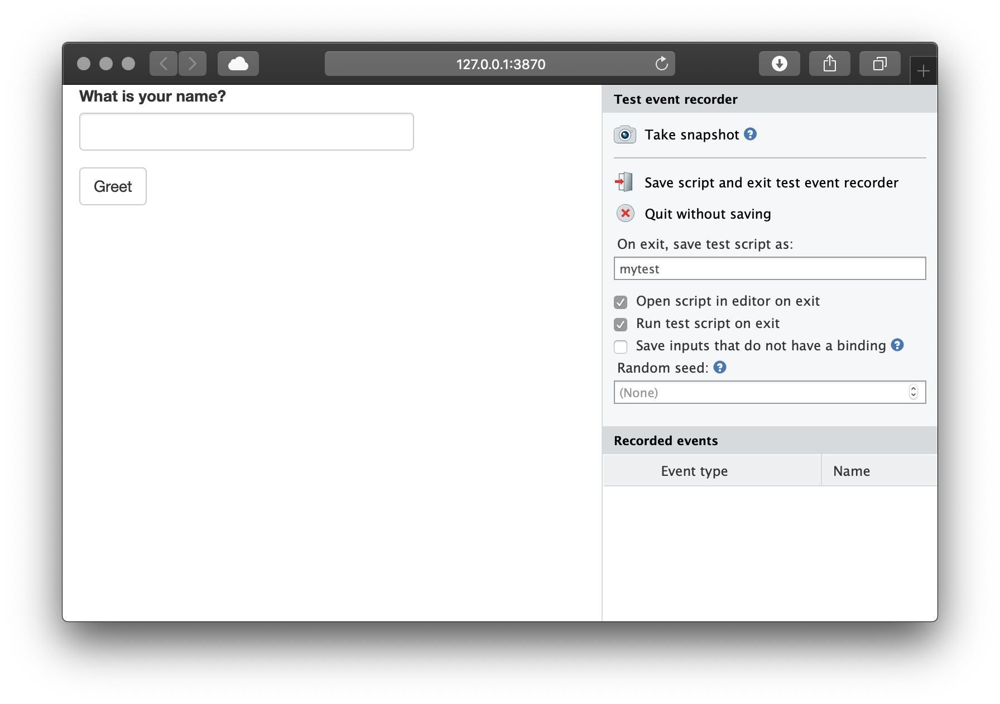
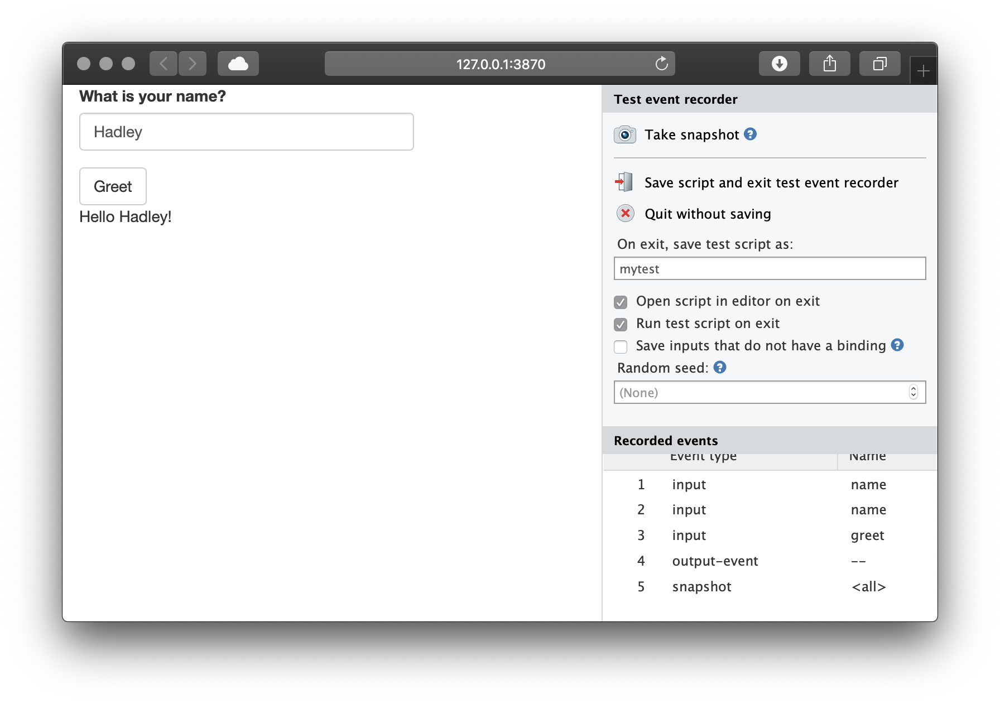
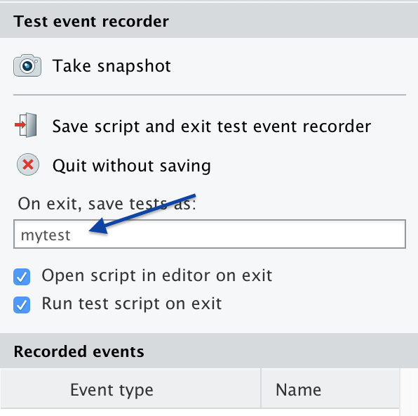

```{r setup, include=FALSE}
knitr::opts_chunk$set(echo = TRUE, eval = FALSE)
```


## Why test Shiny applications?

After you get your Shiny application to a state where it works, it's often useful to have an automated system that checks that it continues to work as expected. There are many possible reasons for an application to stop working. These reasons include:

* An upgraded R package has different behavior. (This could include Shiny itself!)
* You make modifications to your application.
* An external data source stops working, or returns data in a changed format.

One way to detect these problems is with manual testing -- in other words, by having a person interact with the app in a browser -- but this can be time-intensive, inconsistent, and imprecise. Having automated tests can alert you to these kinds of problems quickly and with almost zero effort, after the tests have been created.


## How testing works with shinytest

The **shinytest** package provides tools for creating and running automated tests on Shiny applications.

Shinytest uses snapshot-based testing strategy. The first time it runs a set of tests for an application, it performs some scripted interactions with the app and takes one or more snapshots of the application's state. These snapshots are saved to disk so that future runs of the tests can compare their results to them.

To create tests, the easiest method is to use the `recordTest()` function. This launches the application in a web browser and records your interactions with the application. These interactions are saved in a .R file, and are run using the strategy described above.


## Getting started

**Shinytest** is in active development. To install it, run:

```{r}
library(devtools)
install_github("rstudio/shinytest")
```


### Recording tests

This is the general procedure for recording tests:

* Run `recordTest()` to launch the app in a test recorder.
* Create the tests by interacting with the application and telling the recorder to snapshot the state at various points.
* Quit the test recorder. When you do this, three things will happen:
  * The test script will be saved in a .R file in a subdirectory of the application named `tests/`.
  * If you are running in the RStudio IDE, it will automatically open this file in the editor.
  * The test script will be run, and the snapshots will be saved in a subdirectory of the `tests/` directory.

To record tests, run the following:

```{r}
library(shinytest)

# Launch the target app (replace with the correct path)
recordTest("path/to/app")
```

In a separate R process, this launches the Shiny application to be tested. We'll refer to this as the **target app**. This also launches a special Shiny application in the current R process which displays the target app in an iframe and has some controls outside the iframe. We'll refer to this as the **recorder app**. You will see something like this:



On the left is the target app (in this case, the "Shiny Widgets Gallery"), and on the right is the recorder app (titled "Test event recorder"). Note that you may need to make the browser window wider because the recorder panel occupies some space.

The panel on the right displays some controls for the test recorder, as well as a list of **Recorded events**. As you interact with the target app -- in other words, when you set inputs on the app -- you will see those interactions recorded in the Recorded events list.

For testing a Shiny application, setting inputs is only one part. It's also necessary to check that the application produces the correct outputs. This is accomplished by taking snapshots of the application's state.

There are two ways to record output values. One way is to take a **snapshot** of the application's state. This will record all input values, output values, and *exported* values (more on exported values later). To do this, click the "Take snapshot" button on the recorder app.

After modifying some inputs and taking a snapshot, it will look something like this:



It is also possible to take a *target* snapshot. This is a snapshot of one or more specified output (instead of the default, which is to snapshot the entire application). To do this, hold down the Control (or Command) button on your keyboard and click on an output; it will snapshot just that one output.


When you are done recording a sequence of events, click on the "Save script and exit test event recorder" button. If you are in the RStudio IDE, it will open the test script in the `tests/` subdirectory of the application. In this case, the name of the script is `mytest.R`:

```{r}
app <- ShinyDriver$new("..")
app$snapshotInit("mytest")

app$snapshot()
app$setInputs(checkGroup = c("1", "2"))
app$setInputs(checkGroup = c("1", "2", "3"))
app$setInputs(action = "click")
app$snapshot()
```

### Running tests

When you quit the test recorder, it will automatically run the test script. There are three separate components involved in running the tests:

1. First is the **test driver**. This is the R process that coordinates the testing and controls the web browser. When working on creating tests interactively, this is the R process that you use.

1. Next is the **Shiny process**, also known as the **server**. This is the R process that runs the target Shiny application.

1. Finally, there is the **web browser**, also known as the **client**, which connects to the server. This is a headless web browser -- one which renders the web page internally, but doesn't display the content to the screen ([PhantomJS](http://phantomjs.org/)).

When you exit the test recorder, it will by default automatically run the test script, and will print something like this:

```
Saved test code to /path/to/app/tests/mytest.R
Running mytest.R 
====== Comparing mytest ...
  No existing snapshots at mytest-expected/. This is a first run of tests.

Updating baseline snapshot at tests/mytest-expected
Renaming tests/mytest-current
      => tests/mytest-expected.
```

Behind the scenes, it runs `testApp()`. You can manually run the tests with this:

```{r}
testApp("myshinyapp", "mytest")
```

This will play back the interactions and record snapshots, as specified in the test script. The very first time the tests are run, they will be saved in a subdirectory of the app called `tests/mytest-expected`. These are the expected results, and future test runs will be compared against them.

The directory will contain two files for each snapshot. For example:

```
001.json
001.png
```

The .json file is a JSON representation of the state of the application when `app$snapshot()` was called. The .png file is a screenshot of the application, which you can look at to inspect the state of the application.

The JSON file stores the state of all the input, output, and export values at the time of the snapshot:

```json
{
  "input": {
    "action": 1,
    "checkbox": true,
    "checkGroup": ["1", "2", "3"],
    "date": "2014-01-01",
    "dates": ["2014-01-01", "2015-01-01"],
    "file": null,
    "num": 1,
    "radio": "1",
    "select": "1",
    "slider1": 50,
    "slider2": [25, 75],
    "text": "Enter text..."
  },
  "output": {
    "actionOut": "[1] 1\nattr(,\"class\")\n[1] \"integer\"                \"shinyActionButtonValue\"",
    "checkboxOut": "[1] TRUE",
    "checkGroupOut": "[1] \"1\" \"2\" \"3\"",
    "dateOut": "[1] \"2014-01-01\"",
    "datesOut": "[1] \"2014-01-01\" \"2015-01-01\"",
    "fileOut": "NULL",
    "numOut": "[1] 1",
    "radioOut": "[1] \"1\"",
    "selectOut": "[1] \"1\"",
    "slider1Out": "[1] 50",
    "slider2Out": "[1] 25 75",
    "textOut": "[1] \"Enter text...\""
  },
  "export": {}
}
```

If you are using a source control system (like git), you should check in the expected results.


### Subsequent test runs

After the initial test run, you can run the tests again in the future to check for changes in your application's behavior. If there are no changes to the snapshots, you will just see something like this, with no additional output:

```
> testApp("path/to/app")
Running mytest.R 
====== Comparing mytest ... Passed.
```

The results are saved to `tests/mytest-current`, and compared against the saved results in `tests/mytest-expected`. If the results are exactly the same, then the test is considered successful. It will return to the console with no additional output, and delete the `tests/mytest-current` directory.


If there are any differences between the current and expected results, you'll see output like this:

```
Running mytest.R 
====== Comparing mytest ...
  Differences detected between mytest-current/ and mytest-expected/:

    Name         Status      
    001.json  != Files differ
    001.png   != Files differ
Would you like to view the differences between expected and current results [y/n]? 
```

If you press `y` and then Enter, it will open a Shiny application which shows the differences between the expected and current results. For screenshots, the differences will be highlighted in red. You can also choose different ways of viewing the differences in screenshots. It will look something like this:


After inspecting the changes, you can choose to update the expected results (that is, replace the old expected results with the new current results), or to just quit without updating.

You should update the results if the changes are expected. You should quit without updating if the changes are unexpected.

If you want to compare the results again in the future, without running `testApp()`, you can run the following:

```{r}
snapshotCompare("path/to/app/", "mytest")
```


### Multiple test scripts

In the example above, we had a single test script, named `mytest.R`. If you want to have more than one set of tests for an application, you can record new tests, each with a different name. You can enter the name when recording your tests:

```{r echo=FALSE, eval=TRUE}

```

When you run `testApp("path/to/app")`, it will run all the tests scripts in the application's `tests/` directory.


## Interactive R markdown documents

Shinytest can be used with [interactive R markdown documents](http://rmarkdown.rstudio.com/authoring_shiny.html) that use `runtime: shiny` (sometimes also referred to as Shiny documents). This includes those that use the [flexdashboard](http://rmarkdown.rstudio.com/flexdashboard/) package.

Shiny documents have some differences compared to regular Shiny applications, and so the tests are slightly different. For an example of an interactive Rmd with tests, see [here](https://github.com/rstudio/shinytest/tree/master/tests/testthat/recorded_tests/rmd).

### Randomness

In a Shiny Rmd application, the UI of the application is created dynamically, using some randomly generated IDs. To make the results repeatable, you must set a random seed; otherwise the output will have slight differences in each run. See the section on [controlling randomness](in-depth.html#controlling-randomness) for more information.

### One .Rmd file per directory

For testing Shiny documents, only one .Rmd file is allowed per directory. This is because of the way that the test directory is structured. (Note that if you name your Shiny document index.Rmd, then when deployed on Shiny Server, the URL can use the directory name, like http://mydomain.com/dirname/, instead of http://mydomain.com/dirname/index.Rmd. When deployed on RStudio Connect or Shinyapps.io, the filename is automatically not used in the URL.)

### Prerendered Shiny documents

Some Shiny documents use [`runtime: shiny_prerendered`](http://rmarkdown.rstudio.com/authoring_shiny_prerendered.html), which helps speed up page loading time. Normally, the first time these applications are run, they will leave behind a generated .html file as well as a cache directory named myfile_data/.

You can remove these files by adding this to the end of your test script (assuming the name of your document is doc.Rmd):

```{r}
rmarkdown::shiny_prerendered_clean("../doc.Rmd")
```

Alternatively, you can save the generated files, but then the tests will be run with the generated files, so the prerendering step will not be run for future tests.

For an example of a prerendered .Rmd and tests, see [here](https://github.com/rstudio/shinytest/tree/master/tests/testthat/recorded_tests/rmd-prerendered).


## Next

Learn more about shinytest with the [testing in depth](in-depth.html) article.
